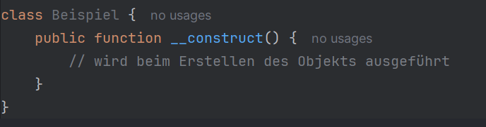
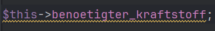
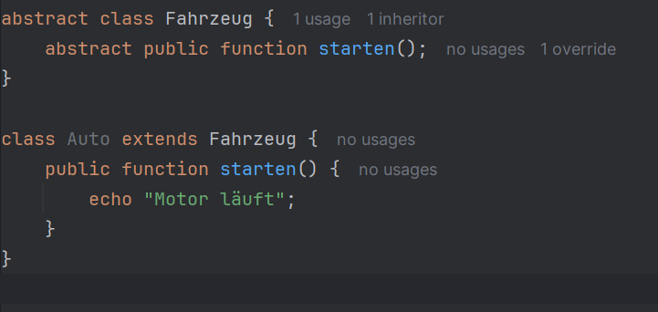

## Framework-Grundlagen
### Bausteine des Frameworks:

-> Config – zentrale Einstellungen (DB, Pfade, URLs, Fehlerlevel)

-> Model – Datenbankzugriffe & Geschäftslogik

-> Controller – verarbeitet Requests, verbindet Model & View

-> Core – Basisfunktionen, Routing, Grundklassen

-> View – Darstellung/HTML-Templates

### Wie sieht die Datenbank aus?

Typischer Aufbau eines MVC-Frameworks:

Tabellen wie users, sessions, notes, roles

Felder z. B. id, user_name, user_email, password_hash, created_at

Struktur orientiert sich an Modellen (z. B. UserModel → users-Tabelle)

### Wozu dient der public-Ordner?

Einziger Ordner, der direkt vom Webserver erreichbar ist

Enthält index.php (Front Controller), CSS, JS, Assets

Schützt Kern-Code vor direktem Zugriff

### Beschreibung der Framework-Bausteine
##### Config

-Enthält alle zentralen Einstellungen

-Initialisiert Konstanten und Framework-Wege

-Macht das System konfigurierbar

##### Model

-Arbeitet mit der DB

-Enthält Abfragen, Validierungen und Logik

-Jede Tabelle hat typischerweise ein eigenes Model

##### Controller

-Nimmt Anfragen entgegen (z. B. /login)

-Ruft die passenden Models auf

-Übergibt Daten an die Views

##### Core

-Kernlogik, z. B. Router, BaseController, Loader

-Stellt grundlegende Funktionen bereit

-Fundament des MVC-Gerüsts

##### View

-Präsentationsschicht

-Minimaler PHP-Anteil, hauptsächlich HTML

-Bekommt Daten vom Controller und rendert sie

1. Wie sieht der Konstruktor in PHP-Klassen aus?

2. Wozu dient die Variable $this?

-Zeigt auf das aktuelle Objekt

-Ermöglicht Zugriff auf Eigenschaften & Methoden desselben Objekts

-Beispiel im Dokument:

3. Welche Vorteile hat OOP in PHP?
   Bessere Struktur & Lesbarkeit

-Wiederverwendbarkeit durch Klassen

-Kapselung & Schutz von Daten

-Erweiterbarkeit durch Vererbung

-Klare Trennung von Logik

4. Welche Datenkapselungsmethoden gibt es?

-public – überall zugänglich

-protected – nur in Klasse + Unterklassen

-private – nur innerhalb der Klasse

5. Wie sehen abstrakte Klassen aus?
