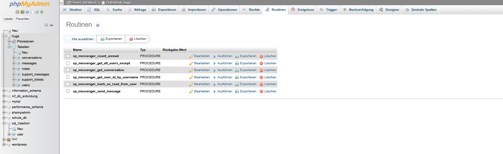

# A10 – Stored Procedures im Messenger (huge Framework)

## Aufgabenstellung
Ziel dieser Aufgabe war es, sämtliche Datenbankabfragen des Messenger-Dienstes im huge Framework durch Stored Procedures zu ersetzen.  
Alle SQL-Statements sollten nicht mehr direkt in PHP stehen, sondern ausschließlich über `CALL`-Aufrufe von gespeicherten Prozeduren ausgeführt werden.

---

## Umsetzung

### 1. Analyse des bestehenden Codes
Zuerst wurden alle SQL-Abfragen im `MessengerModel.php` identifiziert:
- Benutzerliste laden
- Nachrichten senden
- Konversation zwischen zwei Benutzern laden
- Nachrichten als gelesen markieren
- Ungelesene Nachrichten zählen
- Benutzer-ID anhand des Usernamens ermitteln

Diese Abfragen wurden anschließend durch Stored Procedures ersetzt.

---

### 2. Erstellte Stored Procedures (MariaDB / phpMyAdmin)

Folgende Prozeduren wurden in der Datenbank `huge` angelegt:

- `sp_messenger_get_all_users_except`  
  → Gibt alle aktiven Benutzer außer dem aktuellen Benutzer zurück

- `sp_messenger_send_message`  
  → Speichert eine neue Nachricht in der Tabelle `messages`

- `sp_messenger_get_conversation`  
  → Liefert alle Nachrichten zwischen zwei Benutzern inklusive Benutzername

- `sp_messenger_mark_as_read_from_user`  
  → Markiert alle ungelesenen Nachrichten eines Absenders als gelesen

- `sp_messenger_count_unread`  
  → Zählt alle ungelesenen Nachrichten eines Benutzers

- `sp_messenger_get_user_id_by_username`  
  → Ermittelt die user_id anhand des Benutzernamens

Die Prozeduren wurden über den Bereich **Routinen** in phpMyAdmin erstellt.



---

### 3. Anpassung des MessengerModel

Im `MessengerModel.php` wurden alle direkten SQL-Abfragen entfernt und durch `CALL`-Aufrufe ersetzt, z.B.:

```php
$sql = "CALL sp_messenger_get_conversation(:me, :other)";
