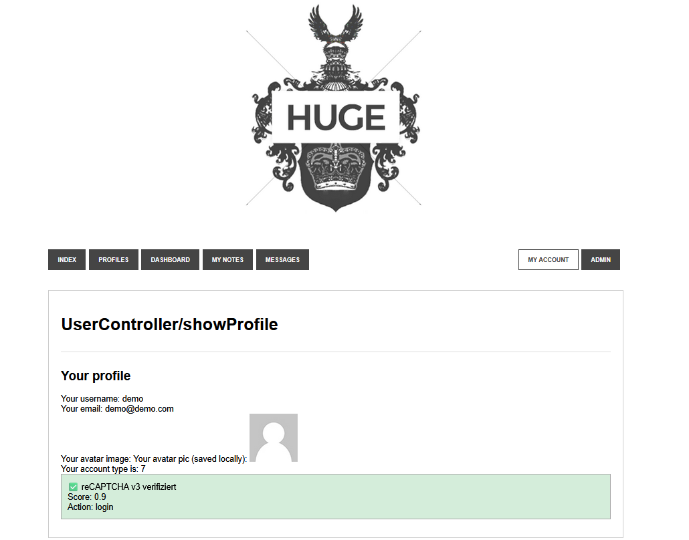

# reCAPTCHA v3 Integration



## Überblick

In diesem Projekt wurde Google reCAPTCHA v3 in den Login-Prozess integriert, um automatisierte Anmeldeversuche zu erkennen und zu blockieren.  
Die Verifikation erfolgt vollständig im Hintergrund und bewertet jede Anfrage mit einem Score zwischen 0.0 und 1.0.

Ein Login wird nur dann zugelassen, wenn:

- die Verifikation erfolgreich ist (`success = true`)
- die Aktion korrekt ist (`action = login`)
- der Score größer oder gleich 0.5 ist

---

## Ziel der Implementierung

- Schutz vor Bot-Logins
- Serverseitige Validierung der reCAPTCHA-Antwort
- Keine sichtbaren Captcha-Checkboxen für Benutzer
- Technischer Nachweis der erfolgreichen Verifikation im Benutzerprofil

---

## Frontend-Integration (Login-Formular)

Im Login-Formular wurde reCAPTCHA v3 clientseitig eingebunden.

### Einbindung des Scripts

```html
<script src="https://www.google.com/recaptcha/api.js?render=SITE_KEY"></script>
